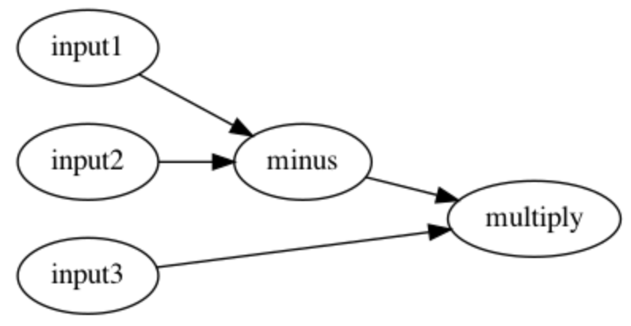

# contrib-workflow-dag

## Overview

This repo provides a DAG layer implementation for running Ray workflows.

DAG layer provides a higher level abstraction on top of workflow steps,
aiming to provide convenience on workflow construction.

## Comparison

**_TODO: This is placeholder for putting a comparison between
using workflow step function vs. workflow graph.   
Discuss with Yi/Zhe/Alex to find a few good examples
for comparison._**   
e.g. 
For sequential, we have `c.step(b.step(a.step())).run` vs 
`DAG.sequential([a, b, c]).execute()`.

Try also to find a multi-branch graph that could benefit from the convenience
of DAG where workflow.step can be very nested and hard-to-read.

## Design
A ***DAG*** contains a set of _**connected Nodes**_.

A DAG/Graph is typically constructed by
`dag.add_edge(from_node, to_node, in_arg_mapping)`.  
`add_edge` adds both Nodes and the connecting edge to the graph, while
`in_arg_mapping` controls how the data stream flows. For example,
`dag.add_edge(A, B, 0)` means adding "Node A -> Node B" to the graph 
while Node A's output will become the input value for first positional argument of Node B.
`in_arg_mapping` can be either positional (int) or kwargs (str).
See [examples](https://github.com/ray-project/contrib-workflow-dag/blob/main/contrib/workflow/examples/simple_dag_example.py#L47)
for better understanding.

DAG can be executed by running `dag.execute()`, optionally with a target
node: `dag.execute(node)` which will execute a sub-graph that runs until
the given node.  

## Quick Start

Run above workflow using graph APIs:
```python
data_input_1 = DataNode("input1", 10)
data_input_2 = DataNode("input2", 20)
data_input_3 = DataNode("input3", 30)

@graph.node
def minus(left: int, right: int) -> int:
    return left - right


@graph.node
def multiply(a: int, b: int) -> int:
    return a * b

dag = DAG()

dag.add_edge(data_input_1, minus, "left")
dag.add_edge(data_input_2, minus, "right")
dag.add_edge(minus, multiply, "a")
dag.add_edge(data_input_3, multiply, "b")

dag.execute()
```


## Open Discussions
1. Why is DataNode necessary? i.e. why wrapping input data into a Node?
Well, having to wrap inputs into a node seems complex and redundant, but it has 
the following benefits:
   1. Completes the graph structure and make inputs clear.  
For multi-input graph like
[this](https://github.com/ray-project/contrib-workflow-dag/blob/main/contrib/workflow/examples/simple_dag_example.py#L37), 
having DataNode will help complete the graph structure and make the input
layer clear re. how many input streams and how each input streams
is connected to operational nodes. And it avoids running execution
as complex as dag.execute(node, input={nodeA: {a: val1, b: val2, ...}, nodeB:{c: val3, d: val4, ...}, nodeC: ...)
   2. Having DataNode sets a standard interface for all types of inputs.  
For example, with a data stream from DB connection, one can simply
subclass DataNode and create a new DBNode which can build the db connection
and deliver data.
   3. DataNode is a standard concept is many graph-based models, e.g. SPSS Modeler.    
   A DataNode can ultimately be used as a placeholder which defines
the intput type, how it is connected to the functional nodes and, etc. Also, 
think about tensorflow - the graph does not hold any real data, but it does
have input layer which defined the shape of the input data. Such placeholder 
is very useful to make the graph clear, complete and strict.
