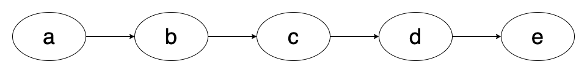
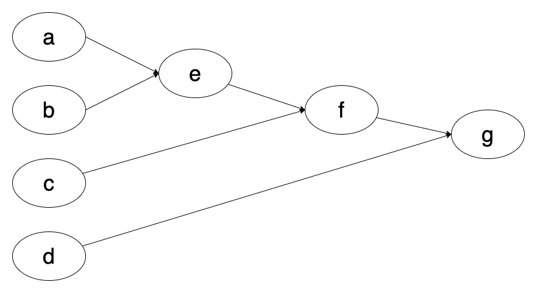
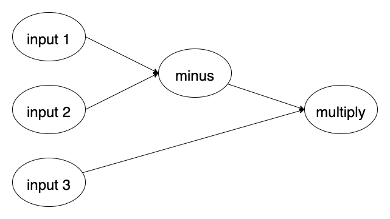

# contrib-workflow-dag

## Overview

This repo provides a **Graph** layer implementation for running Ray workflows.

Graph (i.e. DAG) layer provides a higher level abstraction on top of workflow steps,
aiming to make workflow construction more convenient and intuitive.

## Graph vs. Workflow Step

Existing workflow core apis are not designed for graph-like constructions, therefore,
to construct a real workflow graph, we need to chain different steps 
together in a less-intuitive way, which can grow less readable and harder
to maintain when workflow graph becomes more and more complex.

DAG apis, on the other hand, provides a graph-based construction which 
is more intuitive when building a workflow graph.

Followings are two simple examples for sequential and non-sequential graphs
construction.

### sequential workflow  

- Workflow step
```python
e.step(d.step(c.step(b.step(a.step()))))
```
- DAG: 
```python
DAG.sequential([a, b, c, d, e])
```

### non-sequential workflow

- Workflow step:
```python
g.step(
    f.step(
        e.step(
            a.step(), b.step()
        ), 
        c.step()), 
    d.step()
)
```
- DAG: 
```python
dag = DAG()
dag.add_edge(a, e, 0)
dag.add_edge(b, e, 1)
dag.add_edge(e, f, 0)
dag.add_edge(c, f, 1)
dag.add_edge(f, g, 0)
dag.add_edge(d, g, 1)
```

## Design
A ***DAG*** contains a set of _**connected Nodes**_.

A DAG/Graph is typically constructed by
`dag.add_edge(from_node, to_node, in_arg_mapping)`.  
`add_edge` adds both Nodes and the connecting edge to the graph, while
`in_arg_mapping` controls how the data stream flows. For example,
`dag.add_edge(A, B, 0)` means adding "Node A -> Node B" to the graph 
while Node A's output will become the input value for first positional argument of Node B.
`in_arg_mapping` can be either positional (int) or kwargs (str).
See [examples](https://github.com/ray-project/contrib-workflow-dag/blob/main/contrib/workflow/examples/simple_dag_example.py#L47)
for better understanding.

DAG can be executed by running `dag.execute()`, optionally with a target
node: `dag.execute(node)` which will execute a sub-graph that runs until
the given node.  

## Quick Start


```python
@graph.node
def minus(left: int, right: int) -> int:
    return left - right


@graph.node
def multiply(a: int, b: int) -> int:
    return a * b

dag = DAG()

dag.add_edge(minus, multiply, "a")

data = {
    minus: {
        "left": 10,
        "right": 20
    },
    multiply: {
        "b": 30
    }
}

dag.execute(data)
```
